

# SE-Assignment-5
Installation and Navigation of Visual Studio Code (VS Code)
 Instructions:
Answer the following questions based on your understanding of the installation and navigation of Visual Studio Code (VS Code). Provide detailed explanations and examples where appropriate.

 Questions:

1. Installation of VS Code:
  - Describe the steps to download and install Visual Studio Code on Windows 11 operating system. Include any prerequisites that might be needed.

Prerequisites
Operating System; Windows 11 .
Internet Connection .
Administrator privileges .
1.6 GHz or faster processor .
1 GB of RAM .

Download and Installation;
Go to your favourite browser and type 'visual studio code download' where you will click on the first link you see 'https://code.visualstudio.com>download'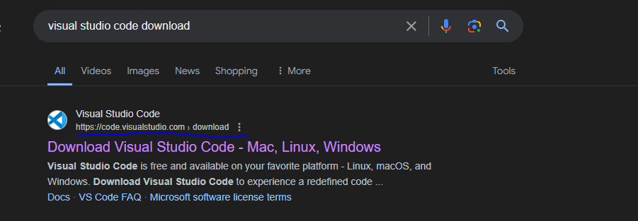 .
Then you will be taken to the visual studio code official webpage 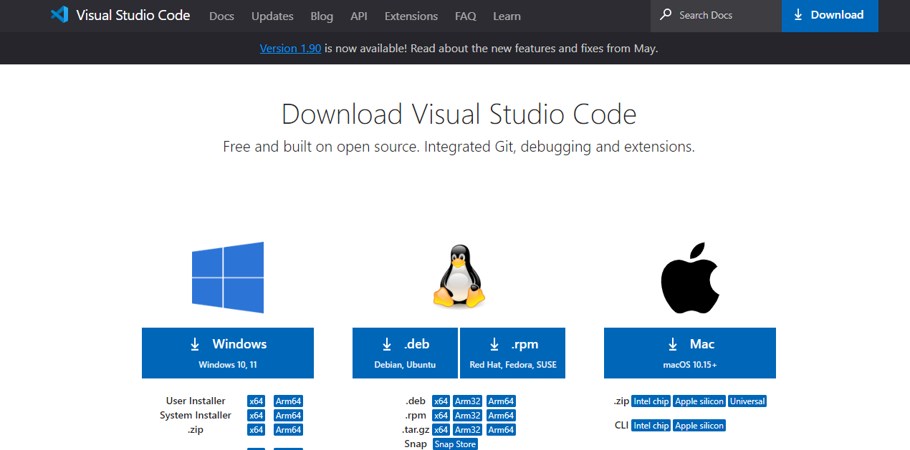 .
Depending on your Operating System you will choose the one you want to download, since I have windows 11 i clicked on 'windows' to start visual studio code download 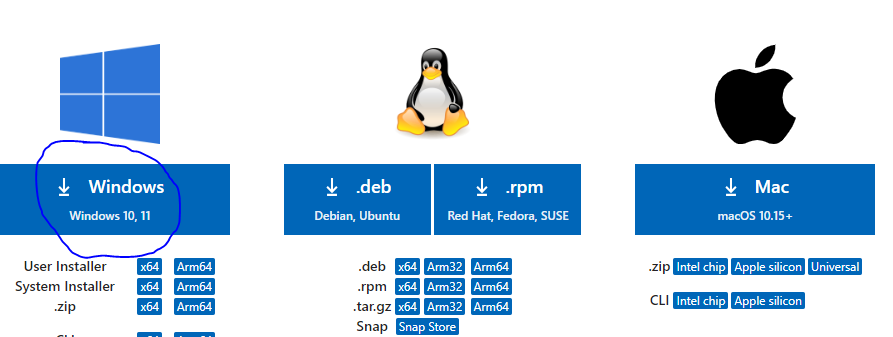 ,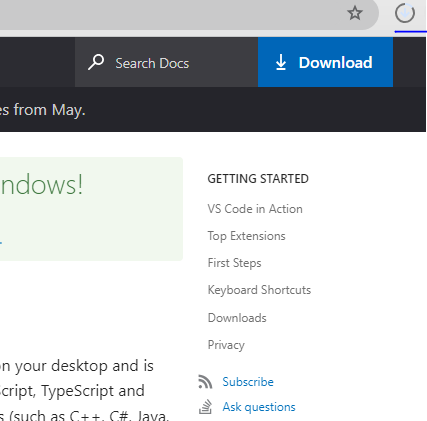
After it has been downloaded then a user lincence agreement will appear and you will accept the agreement and then click next 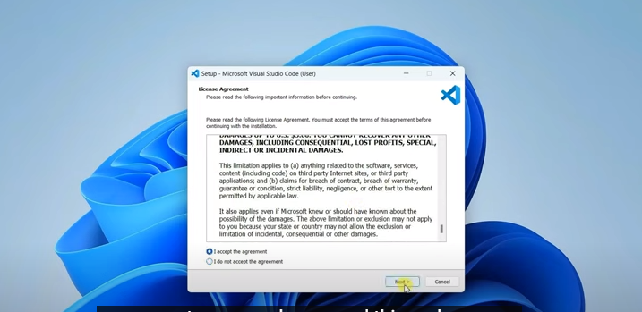 .
Then a path where the visual studio code will be downloaded will be shown but if you do not want the path provided you can change it then click 'next' 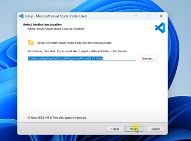 .
Then a visual studio folder is created then click 'next' 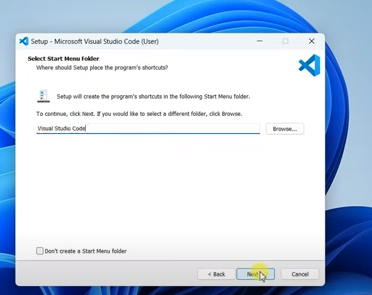 .
Select  the additional tasks you want then click 'next' 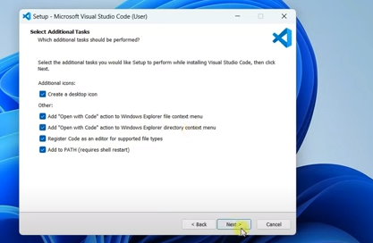 .
Afterwards it will be ready to install then click 'install'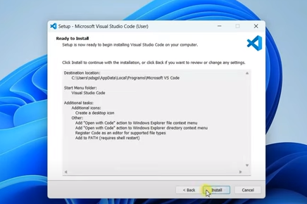 .
The visual studio code will start installing 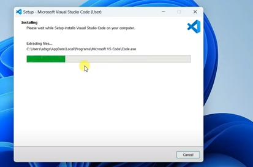 .
After installation the vs code will be launched and ready to be used 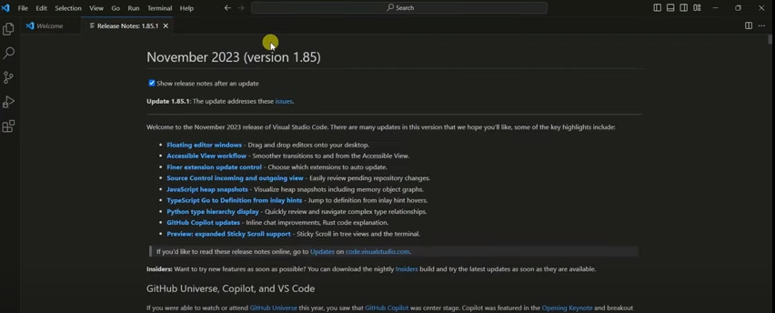, 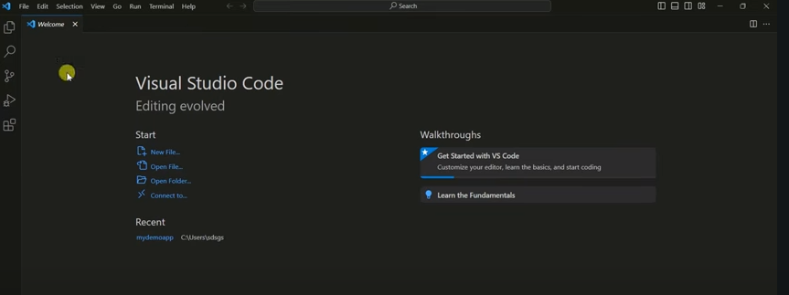 .
The visual studio code can be accessed by typing 'visual studio code' on the search bar.

2. First-time Setup:
   - After installing VS Code, what initial configurations and settings should be adjusted for an optimal coding environment? Mention any important settings or extensions.

Install Essential Extensions:
Bracket Pair Colorizer: Helps differentiate nested brackets with colors.
GitLens: Enhances Git integration with advanced features like blame annotations and commit history.
Code Spell Checker: Provides spell checking for your code comments and strings.
ESLint or Prettier: For JavaScript/TypeScript code formatting and linting.
Live Server: Launches a development server with live reload capability.

Setting up Git and Github and configuring visual studio code settings in order to be able to use them efficiently with vs code.

Enable Recommended Settings:
VS Code often prompts recommended settings adjustments based on your installed extensions and workspace. Review and apply these for optimal performance.

Install Language Support and Debuggers:
Depending on your programming languages, install language support extensions and debuggers from the VS Code marketplace.

Explore Workspaces and Projects:
Familiarize yourself with VS Code workspaces and projects to organize and manage multiple related files effectively.

Update and Maintain VS Code:
Regularly update VS Code and installed extensions to benefit from new features, bug fixes, and security patches.

3. User Interface Overview:
   - Explain the main components of the VS Code user interface. Identify and describe the purpose of the Activity Bar, Side Bar, Editor Group, and Status Bar.

Activity Bar:
The Activity Bar is located vertically on the far left side of the VS Code window. It contains icons that represent different views and functionalities within VS Code.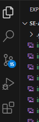  The main sections typically include:
Explorer; This icon resembles a folder and provides access to your file system and workspace. You can navigate through directories, open files, and manage projects.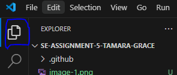 .
Search; Represented by a magnifying glass icon, this section allows you to search for text within files or across the entire project.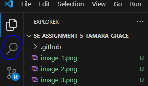 .
Source Control; This icon resembles a Git branch and provides integration with version control systems like Git. It allows you to manage changes, commits, and branches directly from within VS Code.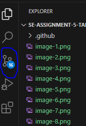
Debug; Represented by a bug icon, this section provides tools for debugging your code. You can set breakpoints, inspect variables, and control the execution flow of your application. 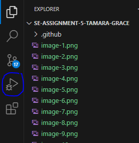
Extensions; This icon resembles a puzzle piece and provides access to the VS Code Marketplace. From here, you can discover, install, and manage extensions that extend the functionality of VS Code. 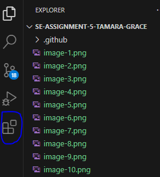

Side Bar:
The Side Bar is located to the left of the editor area and typically displays additional information and actions related to the current view or file. It consists of several sections:
File Explorer; Shows the directory structure of your project and allows you to navigate between files and folders.
Search Results; Displays search results when you perform a global search within your project.
Source Control; Provides a detailed view of changes, commits, branches, and other Git-related actions.
Extensions; Shows information about installed extensions and provides access to their settings and configurations.

Editor Group:
The Editor Group is the central area of the VS Code window where you edit and view your code or text files. It consists of one or more editor tabs, each representing an open file. You can split the editor into multiple columns or rows (editor groups) to work on different files simultaneously.

Status Bar:
The Status Bar is located at the bottom of the VS Code window and provides useful information and quick actions related to your current workspace and file. It includes:
Line and Column Number; Shows the current cursor position in the file.
Language Mode; Displays the language mode of the current file (e.g., JavaScript, Python).
Indentation; Shows the current indentation settings (spaces or tabs).
Encoding; Displays the file encoding format (e.g., UTF-8).
Line Endings; Indicates the line ending style used in the file (e.g., LF, CRLF).
Git Branch; If the file is part of a Git repository, it displays the current branch name.
Notifications; Provides notifications about tasks, errors, and warnings.

4. Command Palette:
   - What is the Command Palette in VS Code, and how can it be accessed? Provide examples of common tasks that can be performed using the Command Palette.

Command Palette in VS Code is a powerful tool that allows users to execute various commands or tasks quickly without navigating through menus or memorizing keyboard shortcuts. It provides a text-based interface where you can search for and run commands.

The command palette can be accessed through;
Keyboard Shortcut: Press Ctrl+Shift+P (Windows/Linux) or Cmd+Shift+P (Mac).
Menu: Click on View in the top menu bar, then select Command Palette.

Examples of Common Tasks that can be performed using command palette;
File Operations;
Create New File: Type File: New File.
Open File: Type File: Open File.
Save File: Type File: Save.

Editing;
Toggle Comment: Type Toggle Line Comment.
Format Document: Type Format Document.

Navigation;
Go to Symbol in File: Type Go to Symbol in File.
Go to Line: Type Go to Line.

Version Control;
Git: Commit: Type Git: Commit.
Git: Pull: Type Git: Pull.
Git: Push: Type Git: Push.

Extensions:
Install Extension: Type Extensions: Install Extensions.
Manage Extensions: Type Extensions: Manage Extensions.  

5. Extensions in VS Code:
   - Discuss the role of extensions in VS Code. How can users find, install, and manage extensions? Provide examples of essential extensions for web development.

Extensions in VS Code enhance its functionality by adding support for new languages, frameworks, debugging tools, themes, and more.
Extensions can be found and installed from market places by;
Click on the Extensions view icon in the Activity Bar (or press Ctrl+Shift+X).
Search for extensions by name or category (e.g., "Python", "GitLens").
Click Install for the extension you want.

They can also be found from VS Code Command Palette;
Open the Command Palette (Ctrl+Shift+P) and type Extensions: Install Extensions.
Search for and install extensions directly.

Examples of Essential Extensions for Web Development:
ESLint: JavaScript linter for code quality.
Prettier: Code formatter for consistent code style.
Live Server: Launches a development server with live reload.
Debugger for Chrome: Enables debugging JavaScript in Chrome from VS Code.
HTML CSS Support: Adds CSS support for HTML documents.
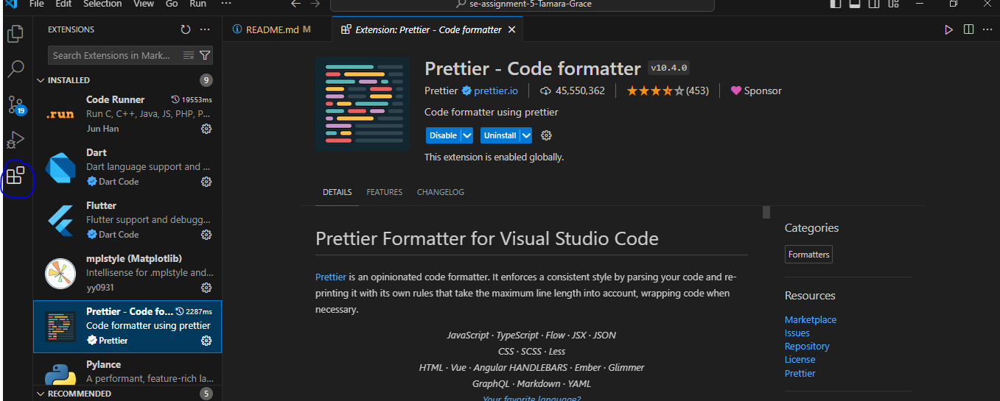 .

6. Integrated Terminal:
   - Describe how to open and use the integrated terminal in VS Code. What are the advantages of using the integrated terminal compared to an external terminal?

The Integrated Terminal in visual studio Code allows you to run shell commands, manage files, and interact with your development environment without leaving the editor.
The intergrated terminal can be opened in two ways;
Menu: Click Terminal in the top menu, then select New Terminal.
Keyboard Shortcut: Ctrl+ ` (backtick).

Advantages of Intergrated Terminal over External Terminal;
The terminal opens in the context of your project's directory, simplifying file and command navigation.
One can access terminal commands alongside your code without switching windows.
You can customize the terminal's appearance, shell, and behavior to suit your preferences.

7. File and Folder Management:
   - Explain how to create, open, and manage files and folders in VS Code. How can users navigate between different files and directories efficiently?
Creating Files and Folders;
Use the Explorer view in the Side Bar to right-click and choose New File or New Folder. 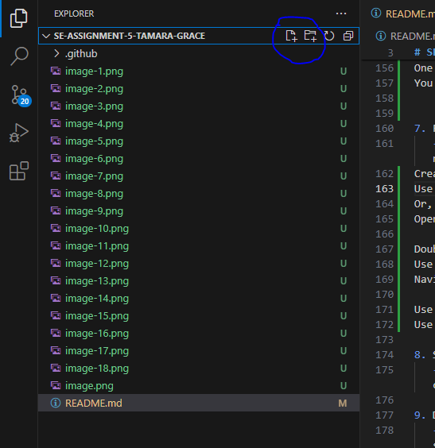
Or, use the Command Palette (Ctrl+Shift+P) and type File: New File.

Opening Files;
Double-click on a file in the Explorer view.
Use the Command Palette (Ctrl+P) to search and open a file by name. 

Navigating Between Files and Directories;
Use the Explorer view in the Side Bar to navigate through directories and open files.
Use keyboard shortcuts like Ctrl+Tab to switch between open files.

8. Settings and Preferences:
   - Where can users find and customize settings in VS Code? Provide examples of how to change the theme, font size, and keybindings.
Finding and Customizing Settings;
Open File > Preferences > Settings (or Ctrl+,).

Changing Theme;
Search for 'workbench.colorTheme' in settings and select a theme (e.g., "Dark+ (default dark)").

Adjusting Font Size;
Search for 'editor.fontSize' and set the desired size (e.g., 14).

Customizing Keybindings;
Search for keybindings in settings to modify or add new keyboard shortcuts.

9. Debugging in VS Code:
   - Outline the steps to set up and start debugging a simple program in VS Code. What are some key debugging features available in VS Code?
Steps to setting up;   
Click on the Debug view icon in the Activity Bar (or press Ctrl+Shift+D).
Open the file you want to debug and click in the gutter next to the line number to set a breakpoint.
Start Debugging;
Press F5 or click Start Debugging in the Debug view.

Key Debugging Features:
Variables: View and monitor variables' values during debugging.
Watch: Evaluate expressions and variables in real-time.
Call Stack: Navigate through the call stack to understand program flow.

10. Using Source Control:
    - How can users integrate Git with VS Code for version control? Describe the process of initializing a repository, making commits, and pushing changes to GitHub.

Integrating Git with VS Code;
Initialize a Repository:
Open the Command Palette (Ctrl+Shift+P) and type Git: Initialize Repository.
Select a directory to initialize as a Git repository.

Making Commits;
Stage changes by clicking the + icon next to modified files in the Source Control view (Ctrl+Shift+G).
Enter a commit message and click the check mark (✓) to commit.

Pushing Changes to GitHub;
Configure Git to connect to your GitHub account if not already set up.
Push commits to a remote repository using the Source Control view (Ctrl+Shift+G) or Command Palette (Git: Push).

References;
My Personal Visual Studio Code .
Youtube .
Chat GPT .

 Submission Guidelines:
- Your answers should be well-structured, concise, and to the point.
- Provide screenshots or step-by-step instructions where applicable.
- Cite any references or sources you use in your answers.
- Submit your completed assignment by 1st July 

